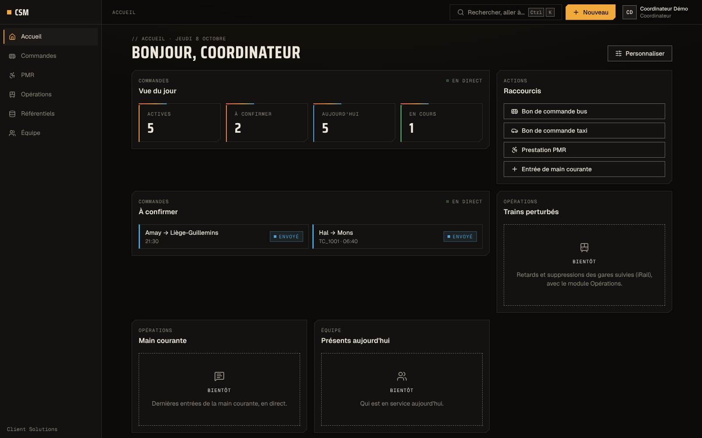
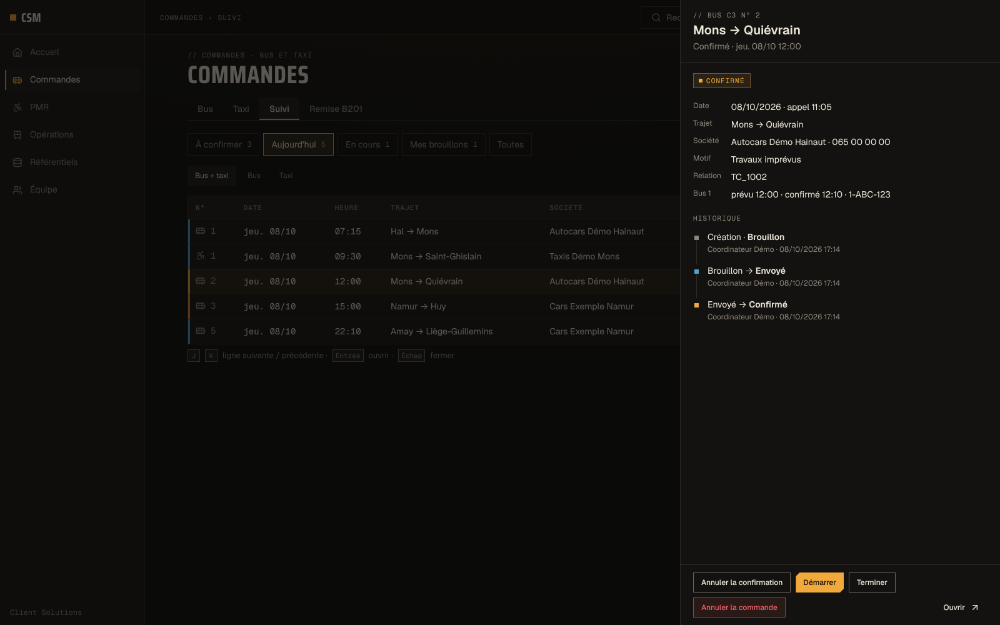
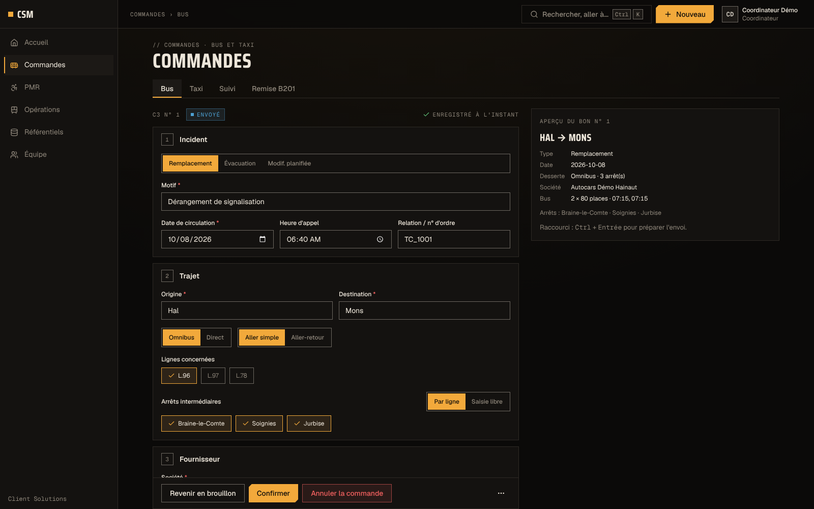
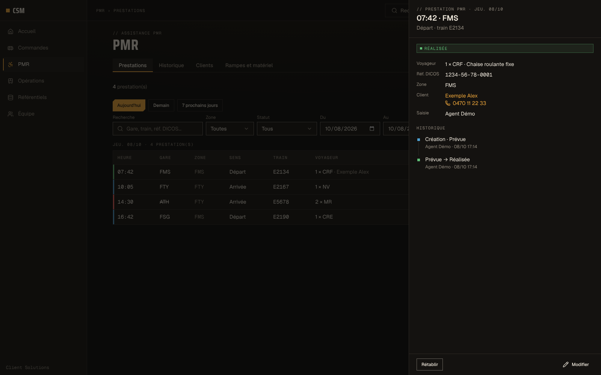

# CSM — Client Solutions Management Tool

**Le poste de travail web d'une équipe d'opérateurs du service clientèle ferroviaire : commandes de bus et de taxis de remplacement, assistance aux voyageurs à mobilité réduite et suivi partagé en temps réel.**

## Description

CSM remplace un premier outil interne par une application web plus rapide, plus sûre et utilisable sur mobile.
Les opérateurs y préparent et suivent les bus de remplacement et les taxis lors des perturbations, du brouillon
jusqu'à la fin de la mission, avec un historique complet de chaque changement de statut. Le module d'assistance PMR
transforme une réservation collée en prestations structurées et suit l'état des rampes d'accès en gare.
Tout est pensé pour la salle de contrôle : écrans denses, raccourcis clavier, mises à jour en direct entre les postes.

## Fonctionnalités clés

- **Bons de commande bus et taxi** : enregistrement automatique, modèles partagés, duplication, PDF généré côté
  serveur et brouillon d'e-mail prêt à envoyer.
- **Suivi partagé en temps réel** : vues enregistrées, panneau latéral, cycle de vie complet
  (brouillon → envoyé → confirmé → en cours → terminé) et historique horodaté.
- **Rapport de remise de service** généré à partir des commandes du jour, exportable en PDF.
- **Assistance PMR** : collage d'une réservation analysé en prestations (aller-retour, horaires, train), anonymisation
  automatique après douze mois.
- **Rampes et matériel d'accessibilité** : état, validité des contrôles, demandes de réparation, historique.
- **Cinq thèmes accessibles (contraste AA)**, interface mobile complète, palette de commandes ⌘K.

## Stack

Next.js 15 (App Router, Server Actions) · React 19 · TypeScript strict · Tailwind CSS v4 · zod · PocketBase
(règles d'accès par rôle, hooks, migrations) · temps réel SSE · pdf-lib · Vitest et Playwright · Docker / Coolify.

## Statut

En développement, en test interne. Année : 2026.

## Captures

Données entièrement fictives (instance de démonstration).

| | |
|---|---|
|  |  |
| Tableau de bord | Suivi des commandes, panneau latéral |
|  |  |
| Bon de commande bus | Prestations PMR |
